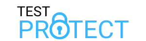
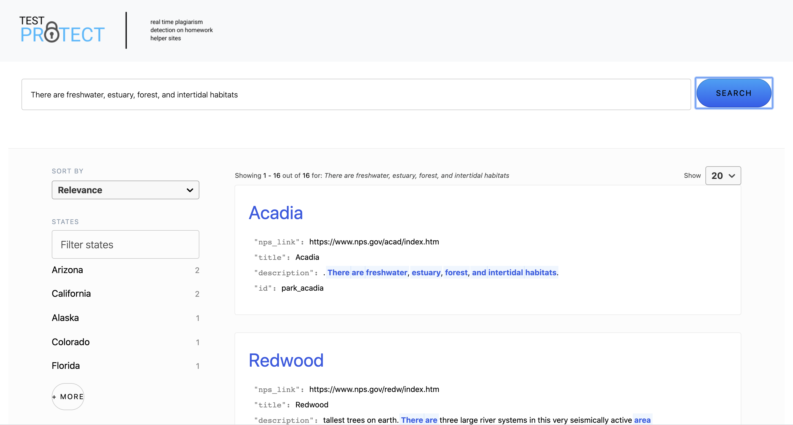
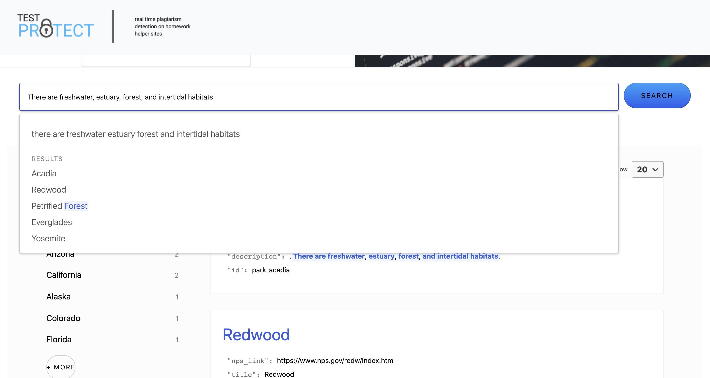

# 

A tool for real time plagiarism detection on homework helper sites like Chegg and CourseHero

## Motivation 

Due to the COVID-19 pandemic, most schools are planning to move to remote learning for the foreseeable future, 
which brings its own set of challenges. A very prominent challenge is the increased incidences of plagiarism 
and other university/school honor code violations. To battle this, we have developed an application that allows the teaching 
staff to monitor commonly known websites that host homework/test solutions such as Chegg & Coursehero real-time 
for posts asking for solutions to their unique questions. This will relieve the staff from the burden of having to manually search for these posts -- an arduous undertaking. It would be particularly helpful to teachers from schools that are unable to allocate sufficient resources or time to tackle the increase in the number of plagiarism incidents.

## How It Should Look / What We Have Done

As clear from the page, the site will primarily have a search function. This is where the unique question will be input. It will scrape the various sites that the unethical sharing of these questions occur, and will come up with the result of where a match was found. We could not scrape the sites during this hackathon because they require paid accounts, so we added dummy data of natural wonders (actual content of the sample data is arbitrary). The site also has a login function so a users searches can be saved. 

## Preview Images

This is a static preview of the site landing page in its current form:

Here is the search bar in action:

Here are the search results (search made to match dummy data):

## Prerequisite
1) [NVM](https://github.com/nvm-sh/nvm#installing-and-updating) (recommended)
2) [Node.js with NPM](https://github.com/nvm-sh/nvm#usage)

## Setup   
1. Install required npm packages by `npm install`
2. Run the application locally through `npm start` 
   and access main page by typing `localhost:3000` 
   in the address bar of your browser

## Credits
The HTML template used is Story by [HTML5Up](https://html5up.net/).  
Free for personal and commercial use under the CCA 3.0 license (html5up.net/license)

 - Demo Images: [Unsplash](unsplash.com)
 - Icons: [Font Awesome](fontawesome.io)
 - Search bar inspired by and dummy data from: CodeSandBox
 - Other:
     - [jQuery](jquery.com)
	 - [Scrollex](github.com/ajlkn/jquery.scrollex)
	 - [Responsive Tools](github.com/ajlkn/responsive-tools)
